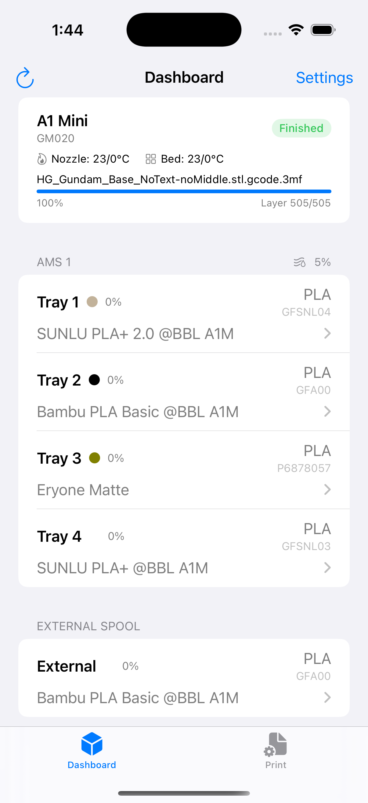
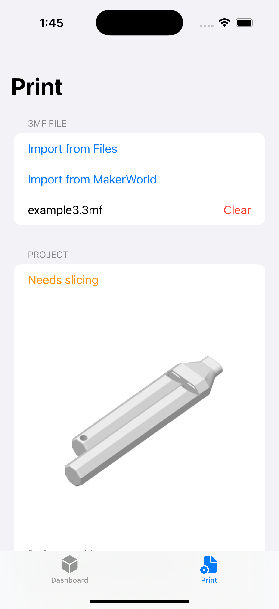
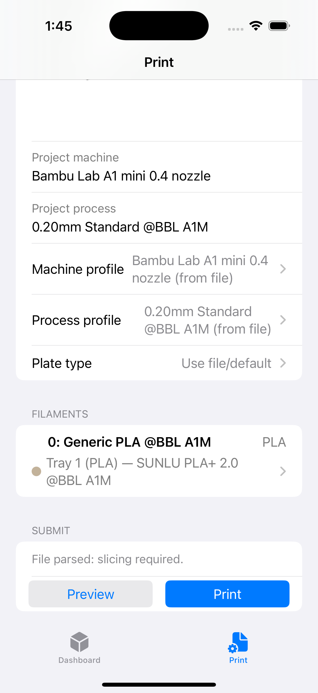
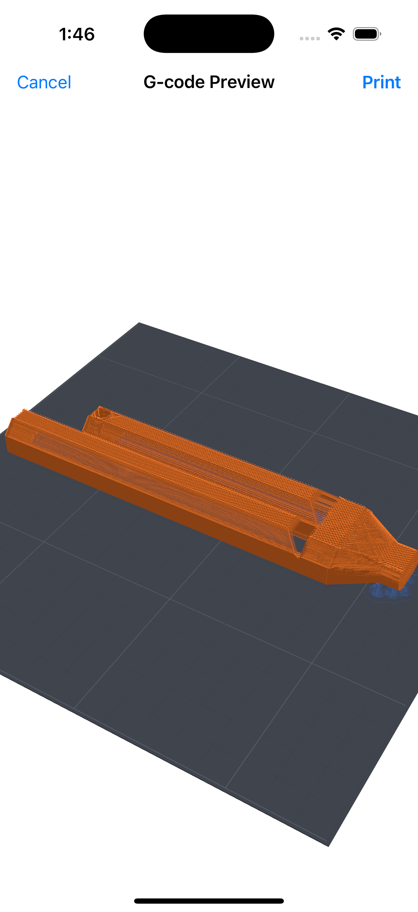

# BambuGateway iOS

iOS client for [Bambu Gateway](https://github.com/leolobato/bambu-gateway) — browse printers, upload 3MF files, preview G-code, and start prints from your phone.

No external dependencies — built entirely with Foundation, SwiftUI, and SceneKit.

## Features

- Connect to a local Bambu Gateway server
- Browse and manage 3MF files for printing
- Preview G-code before printing
- AMS dashboard with per-unit humidity, filament remaining, and tray details
- Auto-match project filaments to AMS trays by filament ID or type, even custom profiles from OrcaSlicer
- Configure printer profiles, filaments, and plates
- Browse MakerWorld for models
- Share Extension for quick file imports from MakerWorld and other apps

### Live Activities and notifications

- Live Activity on the Lock Screen / Dynamic Island during prints, with
  progress %, remaining time, and current layer.
- Push notifications when prints pause, fail, complete, or go offline.
- Requires the gateway to have APNs credentials configured. Without them,
  the Live Activity still runs while the app is foregrounded, but remote
  updates are disabled.

## Screenshots

<p align="center">
  
  
  
  
</p>

## How it works

The app does not talk to Bambu printers directly. It communicates with a [Bambu Gateway](https://github.com/leolobato/bambu-gateway) server on your local network that proxies printer commands, handles slicing, and manages custom profiles.

### Print workflow

1. Import a `.3mf` file — pick from Files, download from the built-in MakerWorld browser, or share a link from Safari via the Share Extension.
2. The file is uploaded to the gateway, which returns project metadata (plates, filaments, whether it's pre-sliced).
3. Configure filament-to-AMS-tray mappings, machine/process profiles, and plate type. The app auto-matches custom filament profiles when possible.
4. Tap **Preview** to slice and render a 3D G-code preview, or **Print** to send the job directly.

### Deep links

The app registers the `bambugateway://` URL scheme:

| URL | Action |
|---|---|
| `bambugateway://open?url=<encoded-url>` | Download a 3MF from the given URL and open it |

## Requirements

- iOS 18.0+
- Xcode 16+
- [XcodeGen](https://github.com/yonaskolb/XcodeGen)
- A running [Bambu Gateway](https://github.com/leolobato/bambu-gateway) server on your local network

## Building

```bash
# Install XcodeGen if needed
brew install xcodegen

# Generate the Xcode project
xcodegen generate

# Build (no signing required for simulator)
xcodebuild -project BambuGateway.xcodeproj -scheme BambuGateway \
  -destination 'platform=iOS Simulator,name=iPhone 16' build
```

### Signing for a physical device

Copy the example config and set your Apple Development Team ID:

```bash
cp Configuration/LocalSigning.xcconfig.example Configuration/LocalSigning.xcconfig
# Edit LocalSigning.xcconfig and set your DEVELOPMENT_TEAM and APP_BUNDLE_ID
xcodegen generate
```

`LocalSigning.xcconfig` is gitignored and won't be committed.

## Configuration

Point the app at your Bambu Gateway server URL in the Settings screen (e.g. `http://192.168.1.10:4844`).

## Disclaimer

This project was built almost entirely through agentic programming using [Claude Code](https://claude.ai/code). The architecture and implementation were generated through AI-assisted development with human guidance and review.

## License

Bambu Gateway is available under the MIT License. See [LICENSE](LICENSE) for details.